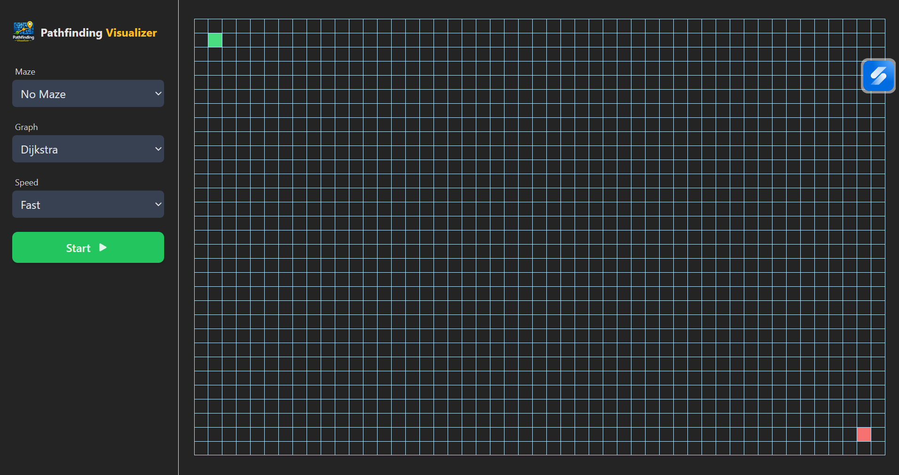
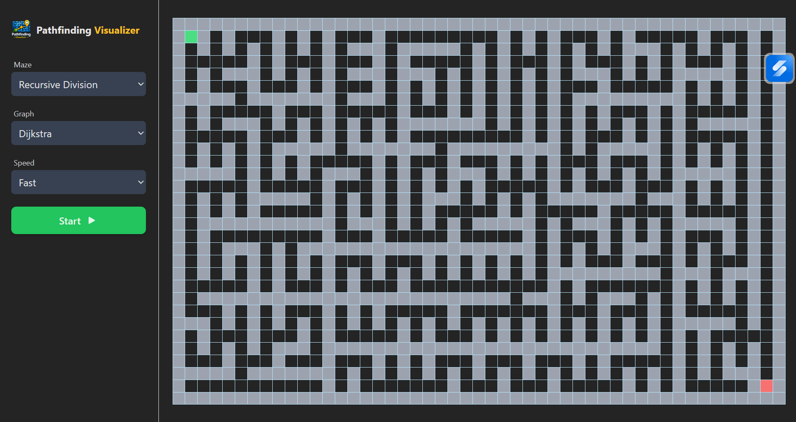
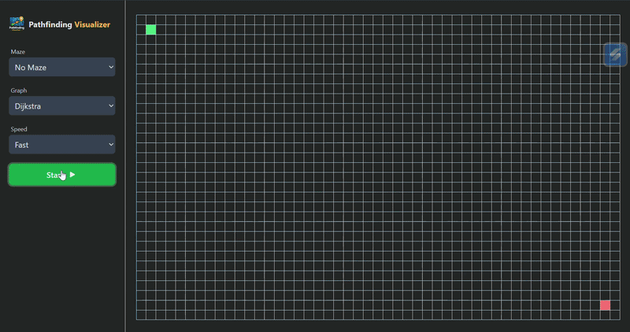

# Pathfinding Visualizer

An interactive pathfinding visualizer built with React, TypeScript, and Vite. Draw walls, generate mazes, and watch classic graph algorithms search for the shortest path in real time — fully responsive across desktop, tablet, and mobile, with native touch support for drawing.

**[Live Demo](https://pathfinding-visualizer-blue.vercel.app/)**






## Features

**Pathfinding algorithms**
- Dijkstra's Algorithm
- A\* Search
- Breadth-First Search (BFS)
- Depth-First Search (DFS)

**Maze generation**
- Binary Tree
- Recursive Division

**Interaction**
- Draw and erase walls with mouse (desktop) or touch (mobile/tablet), via Pointer Events
- Adjustable animation speed (Slow / Medium / Fast)
- Grid automatically resizes to fill the available screen on any device — portrait or landscape

## Tech Stack

| Category | Tools |
|---|---|
| Framework | [React 18](https://react.dev/), [TypeScript](https://www.typescriptlang.org/) |
| Build tool | [Vite](https://vite.dev/) |
| Styling | [Tailwind CSS](https://tailwindcss.com/) |
| State management | React Context API |
| Notifications | [Sonner](https://sonner.emilkowal.ski/) |
| Icons | [react-icons](https://react-icons.github.io/react-icons/) |

## Getting Started

```bash
git clone https://github.com/vivekkmrpaswan/pathfinding-visualizer.git
cd pathfinding-visualizer
npm install
npm run dev
```

Other scripts:

```bash
npm run build     # type-check + production build
npm run preview   # preview the production build locally
npm run lint      # run ESLint
```

## Project Structure
```
src/
├── components/     # Grid, Nav, Tile, Select, PlayButton
├── context/        # PathfindingContext, TileContext, SpeedContext
├── hooks/          # usePathfinding, useTile, useSpeed, useGridDimensions, useIsMobile
├── lib/algorithms/
│   ├── pathfinding/  # dijkstra, aStar, bfs, dfs
│   └── maze/         # binaryTree, recursiveDivision (+ horizontal/vertical division)
└── utils/          # grid helpers, animation, heuristics, constants, types
```
## How It Works

**Responsive grid.** Row/column count isn't fixed — it's derived from the container's actual pixel dimensions via `ResizeObserver` (`useGridDimensions`), so the grid always fills the available space instead of leaving empty margins or overflowing. Tile size itself is exposed as a single CSS variable (`--tile-size`), keeping JS-calculated sizing and rendered layout as one source of truth instead of two values that can drift out of sync.

**Touch drawing.** Wall drawing is built on Pointer Events rather than separate mouse/touch handlers, using `elementFromPoint` to resolve which tile is under the pointer during a drag. This lets one code path handle both mouse and touch input.

**State management.** Grid/algorithm state, tile state, and animation speed each live in their own Context + Provider pair, split into separate files specifically so Vite's Fast Refresh doesn't break during development (a component file exporting both a component and a non-component value opts that file out of Fast Refresh).

## License

This project is open source and available for personal or educational use.